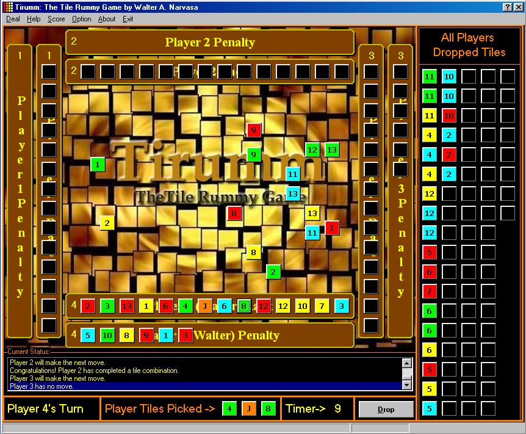



## TILE GAME \(A very addictive tile game\.\.a must see\!\! UPDATED\!\!\)

### Description

Tile Rummy Game a.k.a. "Tirumm" is a very addictive & interesting game that i coded last month of this year. The game rules of this game is very simple, all you have to do is create a series of combination of tiles in a group of 3 tiles with Straight Number but with similar colors or create a 3 same tiles with identical numbers. And the first player who finished dropping all tiles is the winner or if that didn't occur all players tiles will be counted and the winner is the one with the highest score according to player's all tiles value. IF YOU LIKE THIS CODE JUST VOTE FOR IT! Have fun!!
 
### More Info
 

             |
---                |---
**Submitted On**   |2001-04-05 21:09:50
**By**             |[Walter Narvasa](https://github.com/Planet-Source-Code/PSCIndex/blob/master/ByAuthor/walter-narvasa.md)
**Level**          |Advanced
**User Rating**    |4.1 (37 globes from 9 users)
**Compatibility**  |VB 6\.0
**Category**       |[Games](https://github.com/Planet-Source-Code/PSCIndex/blob/master/ByCategory/games__1-38.md)
**World**          |[Visual Basic](https://github.com/Planet-Source-Code/PSCIndex/blob/master/ByWorld/visual-basic.md)
**Archive File**   |[TILE GAME 17966452001\.zip](https://github.com/Planet-Source-Code/walter-narvasa-tile-game-a-very-addictive-tile-game-a-must-see-updated__1-22165/archive/master.zip)

